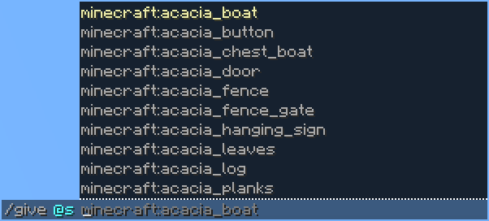

# Fuzzy Autocomplete

A simple Minecraft mod that implements [Fuzzy Search](https://en.wikipedia.org/wiki/Approximate_string_matching) into Minecraft's command autocomplete. This allows for much greater efficiency than only being able to search with the beginning of a string.

The style of the autocomplete is customizable via the config menu.

Fuzzy Autocomplete works mostly client-side, however some matching requires Fuzzy Autocomplete to be installed on the server.

## Supported versions

Currently, the supported versions are: **1.21.x**, and **1.20.0-1.20.1**, fabric only.
I'm open to any version suggestions.

As for other loaders, I might consider support for NeoForge if there's demand for it. Try using [Sinytra Connector](https://modrinth.com/project/u58R1TMW) with [Connector Extras](https://modrinth.com/project/FYpiwiBR).

## Dependencies

- [YetAnotherConfigLib](https://modrinth.com/project/1eAoo2KR) is required on the client.
